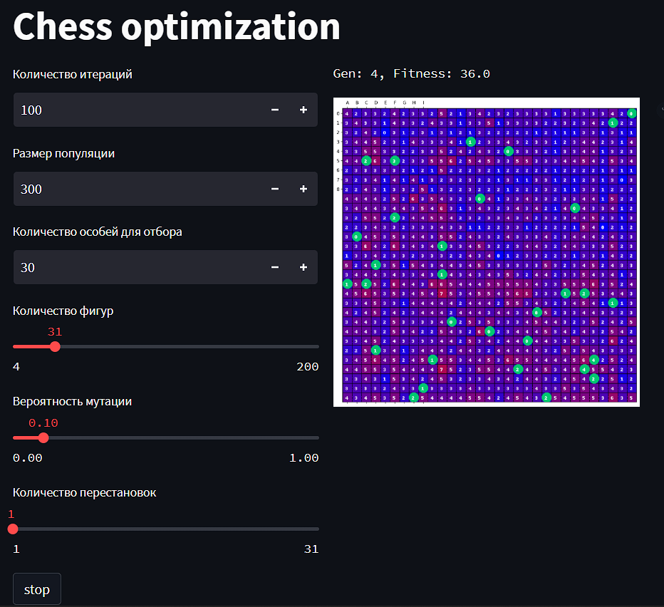

# Эволюционный алгоритм для задачи расстановки ферзей

## Запуск алгоритма

1) Установка streamlit:   
```pip install streamlit```
2) Запуск алгоритма:   
```streamlit run https://github.com/paNoNi/ChessEvolve/blob/master/run.py ```

## Алгоритм работы

1) Фитнесс функция - функция ошибки, которая считает сумму пересечений каждого ферзя с другими.
2) Мутация - один из ферзей с вероятностью p% перемещается в любую доступную клетку
3) Почкование - кроссовер, но только от одно экземпляра. Находится один из
ферзей, находящийся в клетке с наивысшим пересечением с другими ферзями, и 
переносится в клетку с наименьшим пересечением.

## GUI

### Внешний вид пользовательского интерфейса



Значения на доске показывают количество пересечений с ферзями. Цель алгоритма
сделать так, чтобы ферзи (зелёные круги) стояли на клетках со значением 0.

## Эксперименты

| Количество ферзей | Популяция | Количество особей для отбора | Вероятность мутации | Поколений для  сходимости| Фитнесс функция |
| :---: |:---------:|:----------------------------:|:--------------------:|:---------------:|:---------------:|
| 2 |     2     |              1               |         10%          |        1        |        0        |
| 3 |     3     |              1               |         10%          |        1        |        0        |
| 4 |     5     |              1               |         10%          |        1        |        0        |
| 5 |    10    |             3              |         10%          |       2       |        0        |
| 6 |    15    |             5              |         10%          |       3       |        0        |
| 7 |    25    |             5              |         10%          |       3       |        0        |
| 8 |    100    |             5              |         10%          |       4       |        0        |
| 9 |    300    |             10              |         10%          |       4       |        0        |
| 10 |    400    |             10              |         10%          |       4       |        4        |
| 11 |    500    |             10              |         10%          |       4       |        8        |
| 12 |    500    |             10              |         10%          |       4       |        12        |